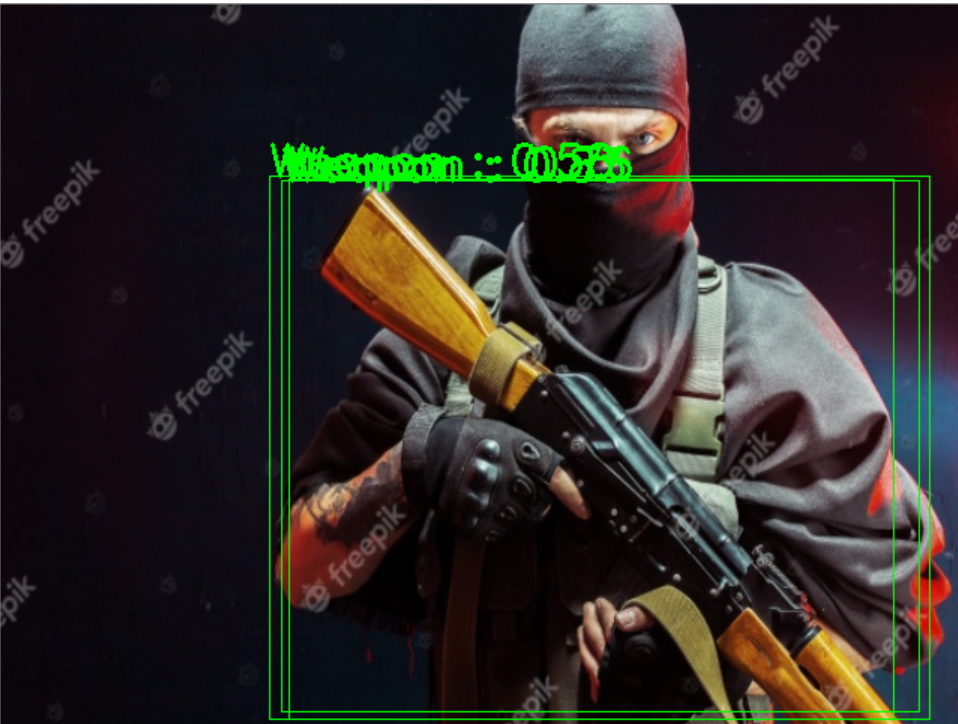
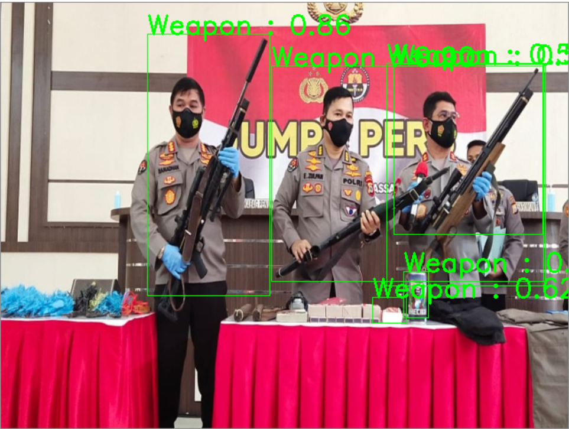
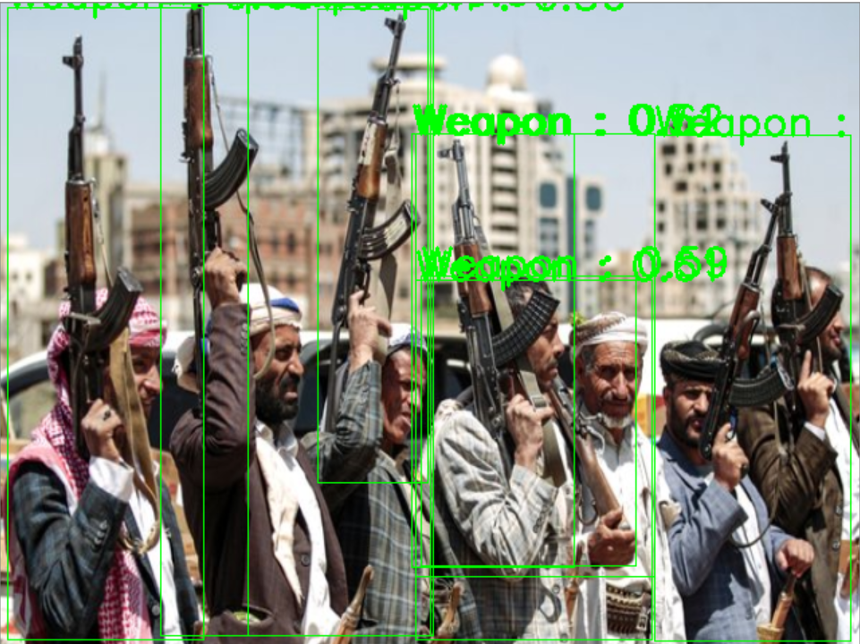

# Weapon Detection DETR

## Description

Weapon detection using DETR model with GUI application based.
You can use this code for another object detection, but you must have a class names, config, weights and height weight model.

## Installation

```bash
$ git clone https://github.com/hafidh561/Weapon-Detection-DETR.git
```

### Installation Python

```bash
# Python version 3.6
$ git clone https://github.com/nodefluxio/vortex.git
$ cd vortex/ && git checkout drop-enforce
$ pip install ./src/runtime[onnxruntime] && cd../
$ pip install -r requirements.txt
$ python download_model.py
```

### Installation Docker

```bash
# Newest docker version
$ docker build -t hafidh561/weapon-detection-detr:1.0 .
```

## Usage

### Usage Python

```bash
$ python app.py -h
usage: app.py [-h] [-s SOURCE_IMG]

optional arguments:
  -h, --help            show this help message and exit
  -s SOURCE_IMG, --source-img SOURCE_IMG
                        Input your image source to detect the object

# Example input
$ python app.py -s test_images/weapon0.jpg
```

### Usage Docker

#### Prerequisite for Windows

1. Download and install [VcXsrv](https://sourceforge.net/projects/vcxsrv/)
2. Run VcXsrv before run this docker app

#### Prerequisite for Linux

```bash
# Expose your xhost
$ xhost +local:docker

# When you finish, you can return the access control by using the following
$ # xhost -local:docker

# Add environment variables
$ XSOCK=/tmp/.X11-unix
$ XAUTH=/tmp/.docker.xauth

# Create the authentication files
$ touch /tmp/.docker.xauth

# Create permission
$ xauth nlist $DISPLAY | sed -e 's/^..../ffff/' | xauth -f $XAUTH nmerge -
```

```bash
$ docker run --rm -e hafidh561/weapon-detection-detr:1.0 -h
usage: app.py [-h] [-s SOURCE_IMG]

optional arguments:
  -h, --help            show this help message and exit
  -s SOURCE_IMG, --source-img SOURCE_IMG
                        Input your image source to detect the object

# Example arguments input
$ docker run --rm -e DISPLAY=192.168.0.2:0 hafidh561/weapon-detection-detr:1.0 -s test_images/weapon0.jpg

# For Operating System Windows
$ docker run --rm -e DISPLAY=<your local ip address>:0 hafidh561/weapon-detection-detr:1.0

# For Operating System Linux
$ docker run --rm -e DISPLAY=$DISPLAY hafidh561/weapon-detection-detr:1.0
```

#### Example







## Give It a Try

If you want make your own deep learning for object detection? Give it a try in this [Google Colab](https://colab.research.google.com/github/hafidh561/Weapon-Detection-DETR/blob/main/jupyter_notebook/train_model.ipynb)

## License

[MIT LICENSE](./LICENSE)

© Developed by [hafidh561](https://github.com/hafidh561) - Internship at Nodeflux
